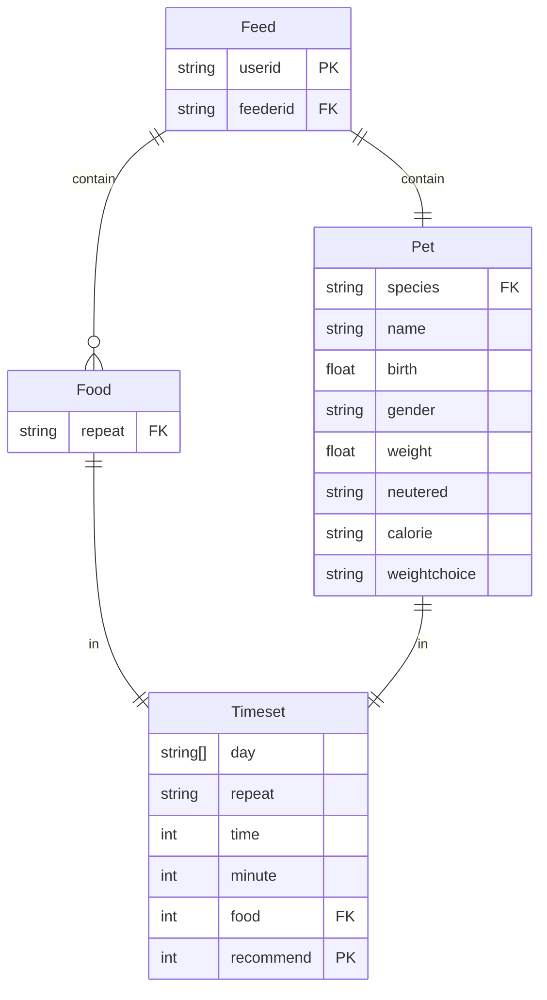

```mermaid
  erDiagram
    Feed {
        string userid PK
        string feederid FK
    }
    Feed ||--|| Pet : contain
    Pet {
        string species FK
        string name
        float birth
        string gender
        float weight
        string neutered
        string calorie
        string weightchoice
    }
    Feed ||--o{ Food : contain
    Food {
        string repeat FK
    }
    Food ||--|| Timeset : in
    Pet ||--|| Timeset : in
    Timeset {
       string[] day 
       string repeat
       int time
       int minute
       int food FK
       int recommend PK
    }
```