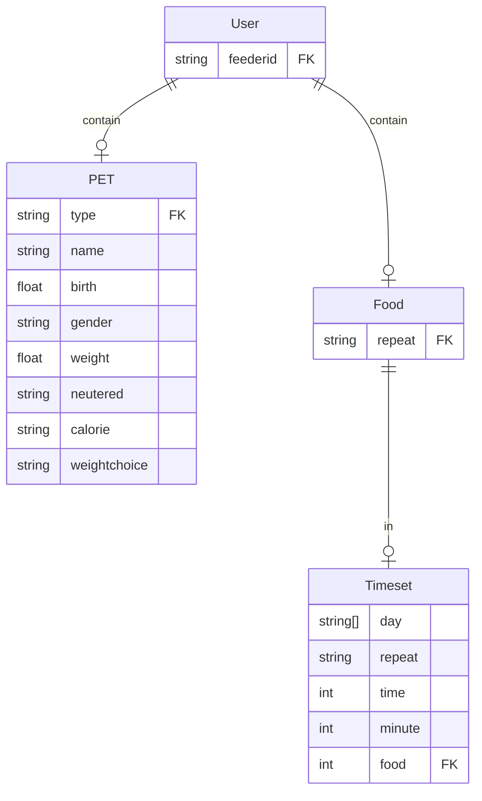

```mermaid
  erDiagram
    User {
        string feederid FK
    }
    User ||--o| PET : contain
    PET {
        string type FK
        string name
        float birth
        string gender
        float weight
        string neutered
        string calorie
        string weightchoice
    }
    User ||--o| Food : contain
    Food {
        string repeat FK
    }
    Food ||--o| Timeset : in
    Timeset {
       string[] day 
       string repeat
       int time
       int minute
       int food FK
    }
```